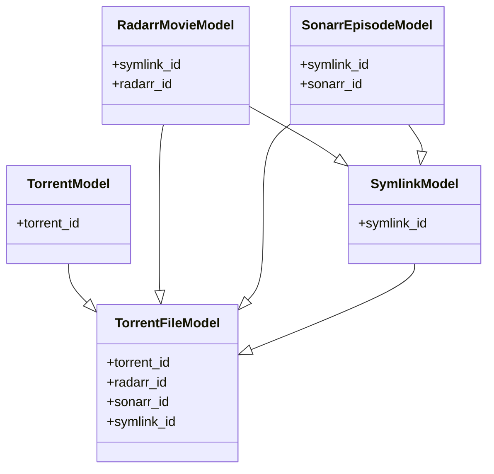

## Relational database for development:

- **TorrentModel** has a one-to-many relationship with **TorrentFileModel** through the foreign key `TorrentFileModel.torrent_id`.

- **RadarrMovieModel** has a one-to-one relationship with **SymlinkModel** through the foreign key `RadarrMovieModel.symlink_id`, and a one-to-one relationship with **TorrentFileModel** through the foreign key `TorrentFileModel.radarr_id`.

- **SonarrEpisodeModel** has a one-to-one relationship with **SymlinkModel** through the foreign key `SonarrEpisodeModel.symlink_id`, and a one-to-one relationship with **TorrentFileModel** through the foreign key `TorrentFileModel.sonarr_id`.

- **SymlinkModel** has a one-to-one relationship with **TorrentFileModel** through the foreign key `TorrentFileModel.symlink_id`, a one-to-one relationship with **RadarrMovieModel** through the foreign key `RadarrMovieModel.symlink_id`, and a one-to-one relationship with **SonarrEpisodeModel** through the foreign key `SonarrEpisodeModel.symlink_id`.

- **TorrentFileModel** has a one-to-one relationship with **SymlinkModel** through the foreign key `TorrentFileModel.symlink_id`, a one-to-one relationship with **RadarrMovieModel** through the foreign key `TorrentFileModel.radarr_id`, a one-to-one relationship with **SonarrEpisodeModel** through the foreign key `TorrentFileModel.sonarr_id`, and a one-to-many relationship with **TorrentModel** through the foreign key `TorrentFileModel.torrent_id`.

